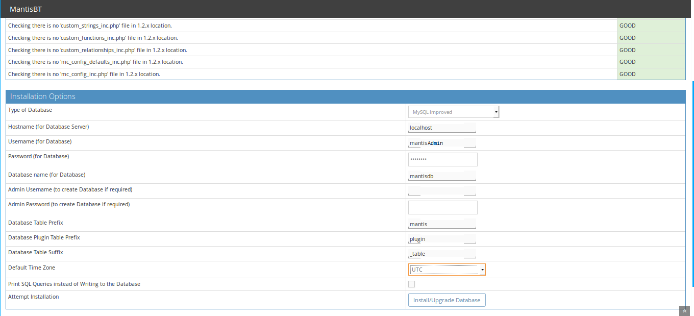
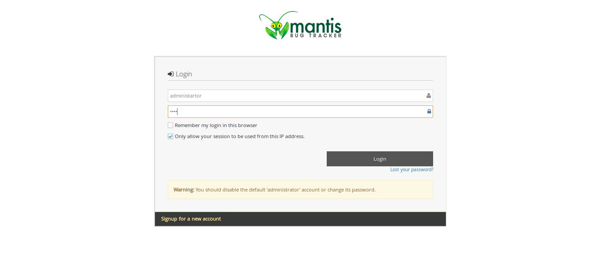
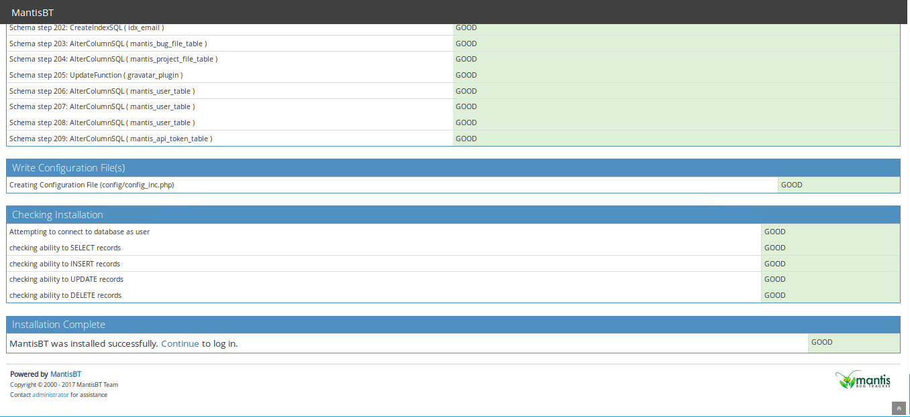
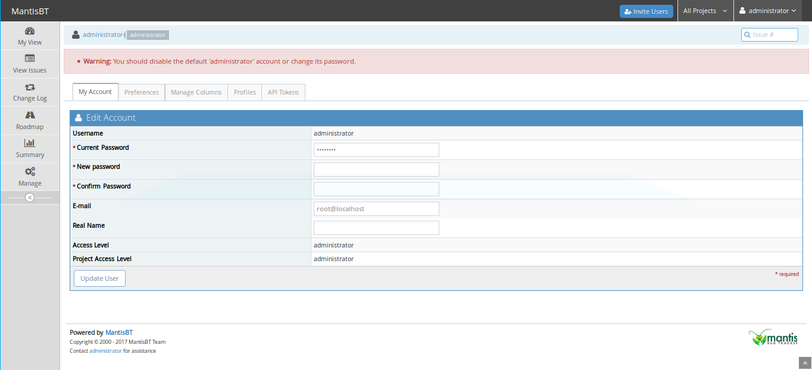

## 內容

* <a href=#introduction>介紹</a>
* <a href=#requirements>軟體需求</a>
* <a href=#started>升級作業系統</a>
* <a href=#lamp>安裝 LAMP</a>
* <a href=#database>設定資料庫</a>
* <a href=#mantis>安裝 Mantis</a>
* <a href=#apache>設定 Apache</a>
* <a href=#access>Mantis 網頁介面的權限</a>
* <a href=#summary>others</a>
* <a href=#reference>文獻</a>

<h2 id=introduction>介紹</h2>
Mantis 是一個建構在網頁上的議題追蹤性統，(用 PHP 寫的開源軟體)。Mantis 具有幾個特徵：
1. 能夠寄送 Email 和 RSS 通知。
2. 客製化議題表單、通知、工作流程。
3. 強大的權限控制。
4. 時序追蹤以及原始碼擴充。
5. 能夠方便地與其它版本控制系統做結合。

<h2 id=requirements>軟體需求</h2>
* CentOS 7. (Basic Web Server)

<h2 id=started>升級作業系統</h2>
首先你需要升級的作業系統至最新版本

```shell
sudo yum install -y
```

假如目前的做也系統已經是最新版本，可跳過這個步驟。

<h2 id=lamp>安裝 LAMP</h2>
在開始安裝 Mantis 之前，需要先安裝 LAMP 組態在你的系統

安裝 Apache 和 MariaDB

```shell
yum install httpd mariadb mariadb-server -y
```

安裝 php

```shell
yum install epel-release -y
rpm -Uvh https://mirror.webtatic.com/yum/el7/webtatic-release.rpm
yum install php71w php71w-cli php71w-mysqli php71w-mbstring -y
```

安裝完成後，啟動 Apache 和 MariaDB 服務，並且設定開機同時啟動

```shell
sudo systemctl start httpd
sudo systemctl start mariadb
sudo systemctl enable httpd
sudo systemctl enable mariadb
```

<h2 id=database>設定資料庫</h2>
設定 root 密碼

```shell
sudo mysql_secure_installation
```

回答 terminal 上，逐條出現的問題

```shell
Enter current password for root (enter for none): Enter
Set root password? [Y/n]: Y
Enter root password: ********
Re-enter root password: ********
Remove anonymous users? [Y/n]: Y
Disallow root login remotely? [Y/n]: Y
Remove test database and access to it? [Y/n]: Y
Reload privilege tables now? [Y/n]: Y
```

登入 MariaDB，隨後輸入上一步驟所設定的密碼

```shell
mysql -u root -p
```

登入 MariaDB 後，創建一個 Mantis 使用的資料庫 *mantisdb*

```mysql
MariaDB [(none)]> create database mantisdb;
```

創建 Mantis 登入資料庫的使用者與帳號

```mysql
MariaDB [(none)]> create user 'mantisAdmin'@'localhost' IDENTIFIED BY 'password';
MariaDB [(none)]> grant all on mantisdb.* to 'mantisAdmin'@'localhost' identified by 'password' with grant option;
MariaDB [(none)]> flush privileges;
MariaDB [(none)]> \q
```

<h2 id=mantis>安裝 Mantis</h2>
下載 Mantis 的最新版本

```shell
wget https://downloads.sourceforge.net/project/mantisbt/mantis-stable/2.18.0/mantisbt-2.18.0.zip
```

解壓縮

```shell
unzip mantisbt-2.18.0.zip
```

把解壓縮地的資料夾移動到 Apache 的根目錄

```shell
sudo mv mantisbt-2.18.0  /var/www/html/mantis
```

給予 Mantis 資料夾 Apache 的群組與權限

```shell
chown -R apache:apache /var/www/html/mantis
```

<h2 id=apache>設定 Apache</h2>
創建 */etc/httpd/conf.d/mantis.conf* 檔案，設定 Apache 的虛擬伺服器指向 Mantis

```shell
vim /etc/httpd/conf.d/mantis.conf
```

加入下列設定敘述：

修改 *ServerAdmin* 與 *ServerName* 成伺服器的 domain name 或 IP address

例如 *Servername 帳號@IP位置*

```shell
<VirtualHost *:80>
    ServerAdmin admin@example.com
    ServerName example.com
    DocumentRoot /var/www/html/mantis

    <Directory />
        Options FollowSymLinks
        AllowOverride All
    </Directory>
    
    <Directory /var/www/html/mantis>
        Options FollowSymLinks MultiViews
        AllowOverride All
        Order allow,deny
        Allow from All
    </Directory>

    TransferLog /var/log/httpd/mantis_access.log
    ErrorLog /var/log/httpd/mantis_error.log
</VirtualHost>
```

儲存設定後，重啟 Apache 服務

```
sudo systemctl restart httpd
```

開啟防火牆、開取80埠

```
systemctl start firewalld.service
firewall-cmd --zone=public --add-service=http --permanent
firewall-cmd --reload
```

<h2 id=access>Mantis 網頁介面的權限</h2>

開啟瀏覽器輸入URL *http://your-server-ip* 會出現以下畫面：



填寫相對應的資料後，例如：資料庫的使用者、登入端、密碼，按下 **Install/Upgrade Database** 會出現以下畫面：



按下 **Continue** 登入 Mantis dashboard：



輸入預設帳號 *administrator* 以及預設密碼 *root*，進入 Mantis dashboard 修改管理者密碼：



<h2 id=others>其他設定</h2>

<h2 id=reference>文獻</h2>
<a href="https://devops.profitbricks.com/tutorials/how-to-install-mantisbt-on-centos-7/">How to Install MantisBT on CentOS 7</a>